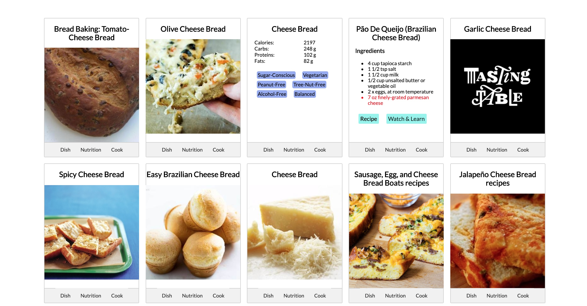

# [Fridge Friend](https://codechung.github.io/fridgefriend/)

Find recipes based on ingredients you have in your refrigerator. Learn more about the recipe's ingredients and nutrition facts. Watch how to make the recipe on youtube.

## Step 1: Add ingredients to the page

## Step 2: Find the recipe you're interested in

## Step 3: Watch videos on how to make the recipe

## Technologies used:

<ul>
    <li>HTML</li>
    <li>CSS</li>
    <li>JavaScript</li>
    <li>Jquery</li>
</ul>